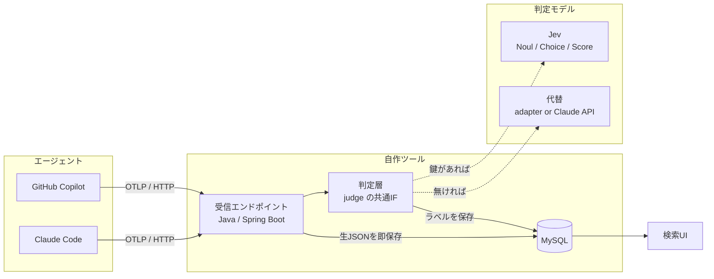
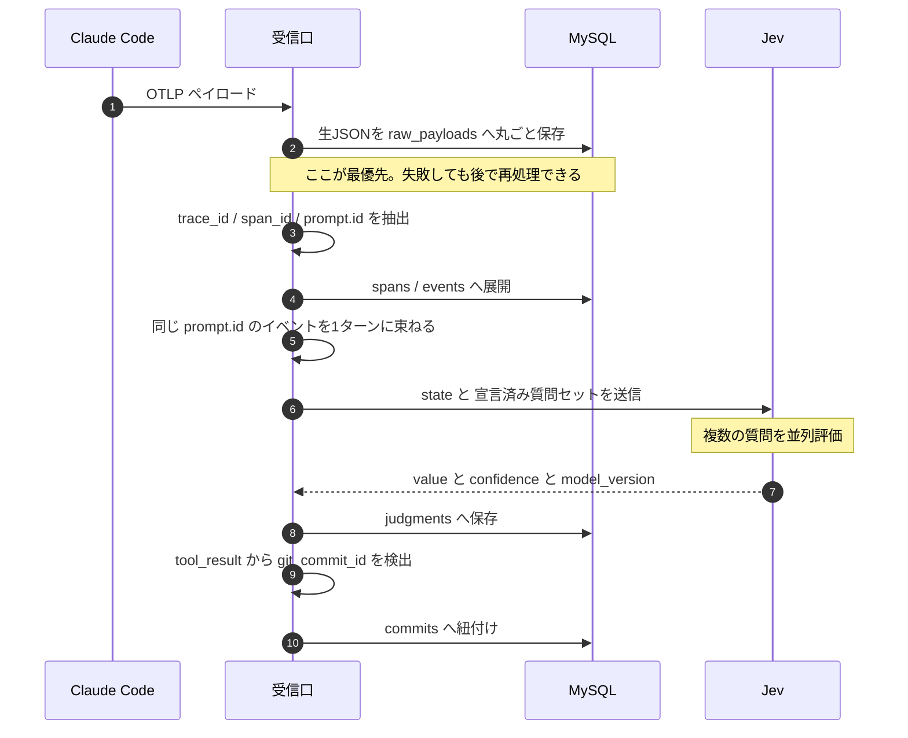
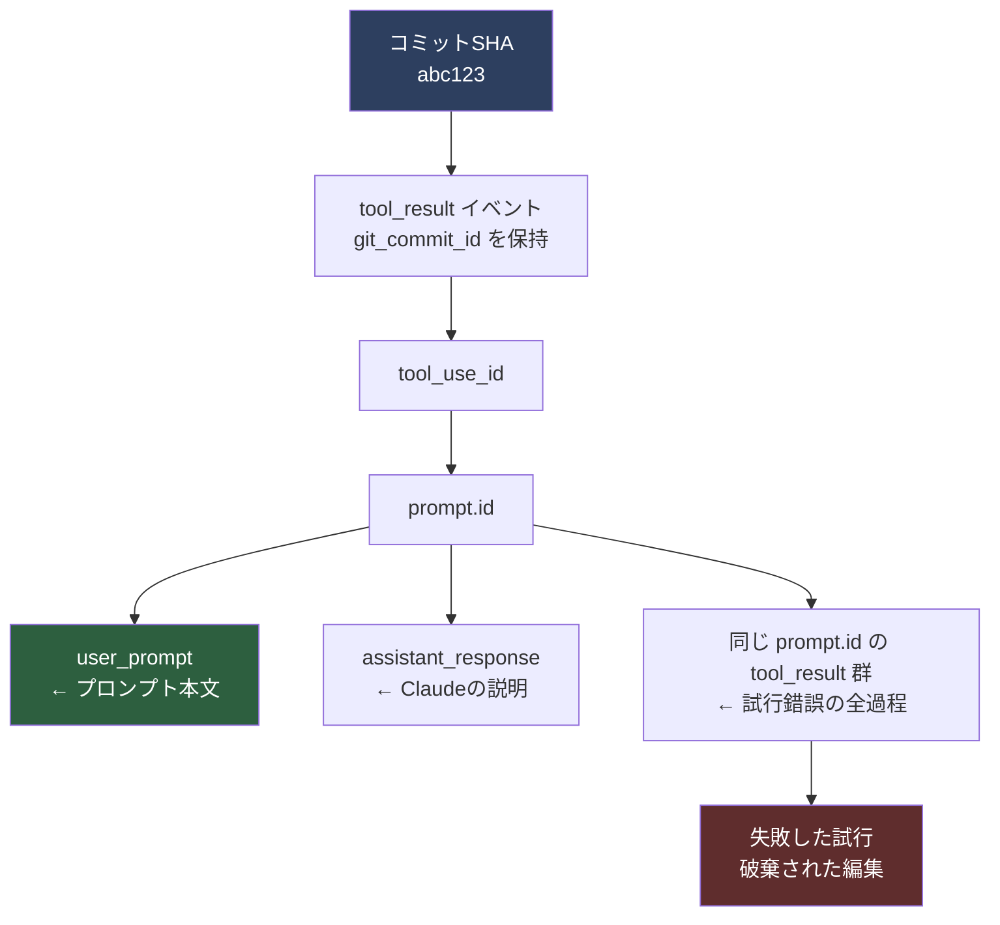
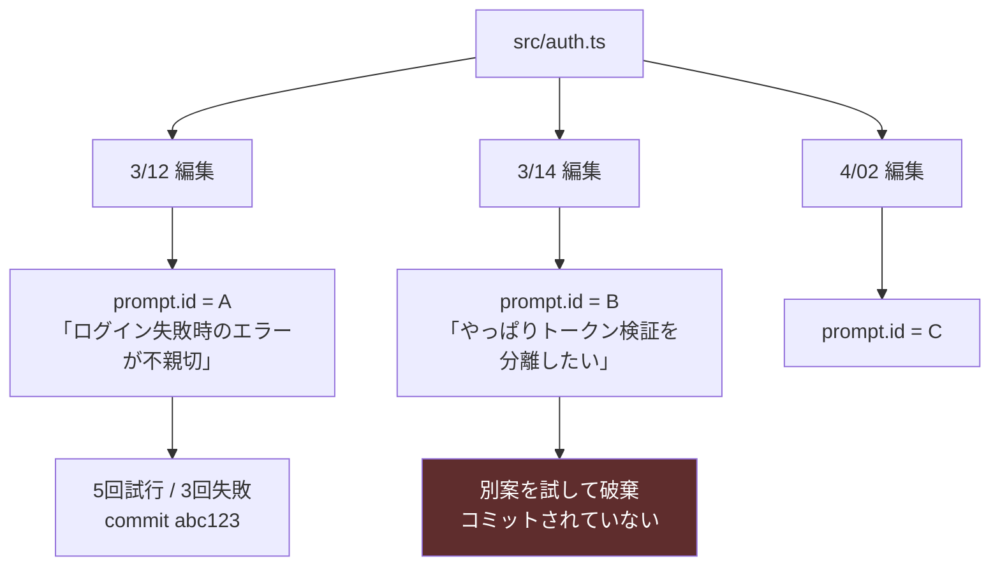
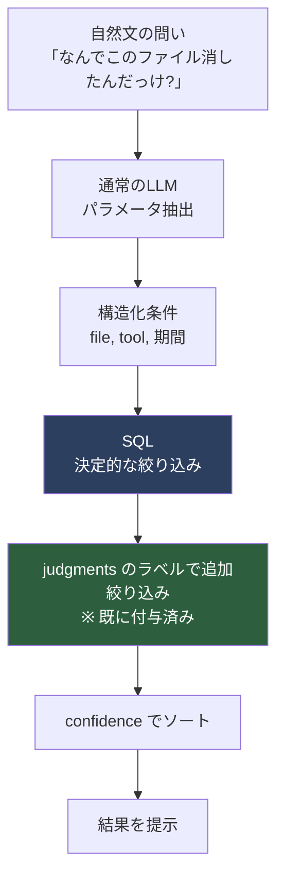
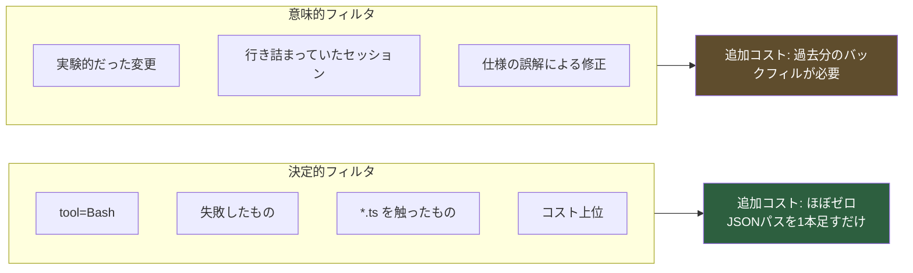
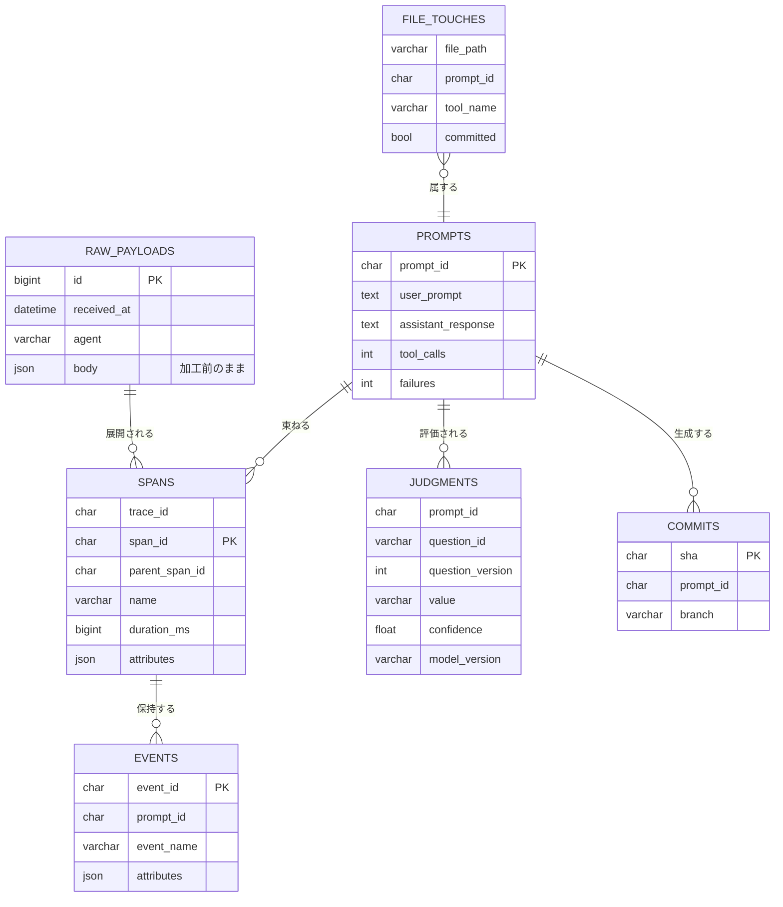
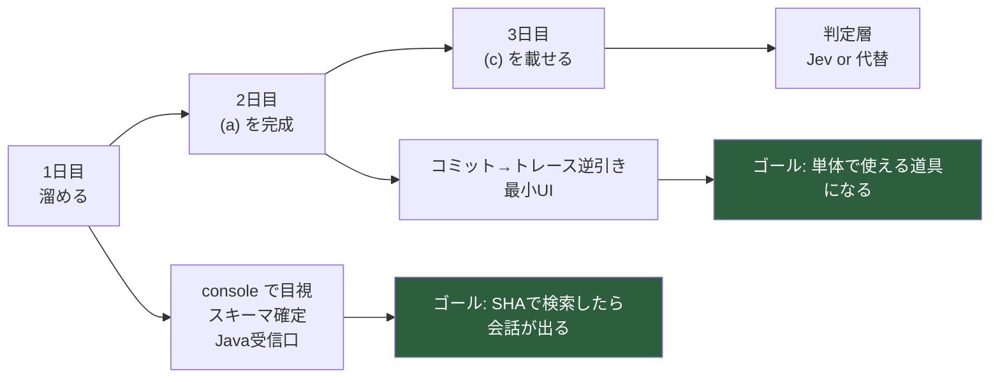

# Agent Trace Store — 設計コンセプト

> **一行で言うと**
> git blame が「誰が・何を」を答えるのに対して、このツールは「なぜ・何を試した末に」を答える。

---

## 0. 三つの設計原則

この3つを守る限り、2〜3日で作るものが将来の足枷にならない。

| # | 原則 | 理由 |
|---|---|---|
| 1 | **生ペイロードを捨てない** | 抽出カラムは「今欲しい検索軸」でしかない。生JSONさえ残っていれば決定的フィルタは無制限に後付けできる。捨てたら再取得は不可能 |
| 2 | **Jev は投入時に回す。検索時ではない** | 検索は決定的なSQLのまま。速度・再現性をモデル精度に賭けない。68%という精度は「検索の精度」ではなく「ラベルの精度」に閉じ込められる |
| 3 | **グラフの起点はファイル。セッションではない** | 「今のコードがなぜこうなったか」を問う以上、出発点は現在のコード＝ファイル |

### なぜ git では足りないのか

**git は勝者しか残さない。**
破棄された試行、revert された編集、書いては消したファイルは `git log` に存在しない。
だが trace には全部残る。「なぜ A ではなく B なのか」は、A を試して失敗した記録がないと答えられない。

---

## 1. 全体構成



> **ポイント** — Python の正規化層は不要。両エージェントとも OTLP で出るうえ、
> OTel GenAI Semantic Conventions という共通語が既にある。

---

## 2. 投入時のデータフロー

トレースが届いた瞬間に、その場でラベルを付けてしまう。



### 束ねる単位は `prompt.id`

1つのユーザープロンプトから派生した全イベントを束ねる UUID。
これが「1ターン」の定義になる。

---

## 3. 「なぜ」を辿る結合キーの鎖

**これが目的そのもの。** コミットSHAから逆に辿ると、そのコミットを生んだ会話と試行錯誤がすべて取れる。



> `FAIL` の部分が git に存在しない情報。ここに価値がある。

---

## 4. ファイル起点のタイムライン

主索引はセッションではなくファイルパス。



### ファイル捕捉の弱点

| 経路 | 捕捉 |
|---|---|
| Edit / Write ツール | `file_path` 属性で取れる |
| Bash 経由の `sed` やスクリプト | **属性に出ない** |

**補完手段** — `PostToolUse` フックで `git status --porcelain` を走らせ、差分ファイルを自前で記録する。
OTel とフックは `tool_use_id` で突き合わせられるので後から結合可能。
※ 初回スコープには入れない。拡張余地として認識しておく。

---

## 5. 検索時のフロー

Jev は既にラベルを付け終わっているので、**検索そのものは決定的なSQL**で済む。



### 自然文の振り分けに Jev を使う場合

Choice で「50個から1つ選べ」とやると崩れる。**独立した Noul を並べる。**

```
Noul 「この質問は期間の絞り込みを求めているか」
Noul 「この質問は失敗に関するものか」
Noul 「この質問は特定ファイルに関するものか」
```

> **制約** — Jev は「先週」から日付を生成できない。値を作るのは生成タスクだから。
> 回避策は2つ。
> 1. パラメータ抽出だけ通常のLLMに任せる
> 2. `{今日, 今週, 今月, それ以前}` をバケットとして事前宣言し Choice にする → Jev だけで閉じる

---

## 6. フィルタ追加の2類型



**決定的フィルタが「ほぼゼロ」になる条件 = 原則1を守ること。**
生ペイロードさえ残っていれば、半年後に「MCPサーバー別に見たい」と思っても JSON パスを足すだけ。

---

## 7. テーブル構成



### judgments に4つのメタ列を置く理由

| 列 | 何のため |
|---|---|
| `question_id` | どの質問に答えたか |
| `question_version` | 質問文を書き直したとき、過去の判定と比較できる |
| `confidence` | ソートと足切り。ラベルは「正解」ではなく「候補の並べ替え」 |
| `model_version` | Jev は応答したバージョンIDを返す。しきい値をチューニングしたらエイリアスでなくバージョンIDをピン留めする |

---

## 8. 質問セットの初期案

Jev は複数の質問を並列評価するので、以下を1リクエストで投げられる。

```
Noul   「このターンはバグの修正を意図していたか」
Noul   「このターンで行き詰まりが起きたか（同じ手を繰り返した）」
Noul   「このターンは既存の設計方針からの逸脱を含むか」
Choice 「この変更の主目的は?」
         { 機能追加, バグ修正, リファクタ, 依存更新, 実験 }
Score  「この変更の影響範囲の大きさ」
```

---

## 9. 環境変数

```bash
export CLAUDE_CODE_ENABLE_TELEMETRY=1
export OTEL_LOGS_EXPORTER=otlp
export OTEL_EXPORTER_OTLP_PROTOCOL=http/protobuf
export OTEL_EXPORTER_OTLP_ENDPOINT=http://localhost:4318

export OTEL_LOG_USER_PROMPTS=1
export OTEL_LOG_ASSISTANT_RESPONSES=1
export OTEL_LOG_TOOL_DETAILS=1
```

> **`OTEL_LOG_TOOL_DETAILS=1` は必須。**
> これが無いと `git_commit_id` が出ず、第3章のコミット紐付けが成立しない。

**注意** — `.env` や APIキーを含むファイルを Claude が読んだら、その中身が trace DB に入る。
1人利用でもローカルDB + localhost バインドに限定する。

---

## 10. Jev の前提条件

| 項目 | 内容 |
|---|---|
| 提供形態 | クローズドな管理API のみ。オープンウェイトではない |
| 入手 | 公式コンソールの早期アクセス待機リスト。バッチで鍵を発行 |
| 自己ホスト | 不可。VPC内デプロイも不可 |
| 入力 | テキストのみ。画像・音声・動画は非対応 |
| 制限 | リクエスト全体 64,000トークン / state + 最長の質問 32,000トークン |
| 精度 | 公式4ワークフローのベンチで約68% |

### 鍵が間に合わない場合

`system-one-adapter-python` が GitHub にあり、既存LLM上で Jev の型付きスキーマを模擬できる。

**重要** — 判定層のインターフェースを Jev の3プリミティブに合わせておけば、中身は後から差し替えられる。

```
judge(state, question) -> { value, confidence, model_version }
```

---

## 11. 3日間の進行



Copilot 対応は1日目に入れない。2日目までで単体完結させ、崩れても成果が残る形にする。

---

## 12. 共通スキーマに関する注記（Copilot連携前に必読）

Claude 側と Copilot 側を別々に実装し始めた時点で追記。**両エージェントの raw イベントを1つのテーブル群に正規化するときの2つの罠。**

### 12-1. `trace_id` を額面通りの共通列にしない

Claude Code の実データ（otel-out3.txt 解析）では `traceId`/`spanId` が終始 `undefined` だった（ログのみの設定で分散トレーシング span が有効になっていないため）。Claude 側で実際に機能している結合キーは `prompt_id`（本書 §2, §7 の `EVENTS.prompt_id` / `PROMPTS.prompt_id`）であり、これは OTel の `trace_id` とは別物。

一方 Copilot 側（VS Code 拡張）は正式な OTel SDK 実装で `invoke_agent` / `chat` / `execute_tool` のスパン階層を持つため、本物の `trace_id`/`span_id` が入っている可能性がある（未検証）。

→ **対処**: raw イベントの共通スキーマでは `trace_id` という名前をそのまま普遍列として置かない。`correlation_id`（仮称）のような中立な列名にして、エージェントごとのアダプタで「Claude なら `prompt_id` から、Copilot なら実際に取れる `trace_id`（確認でき次第）から埋める」というマッピングを持たせる。

### 12-2. `file_path` を raw イベント共通列にしない

`file_path` が乗るのは Edit/Write など一部のツール呼び出しのみ（§4「ファイル捕捉の弱点」参照）。`UserPromptSubmit`/`Stop`/Bash 経由の操作には乗らない。

→ **対処**: §7 のテーブル構成ですでに `FILE_TOUCHES` を独立テーブルとして分離してある。この設計をそのまま踏襲し、`file_path` は「ファイルに触れたイベントだけが持つ派生列」として扱う。raw イベントの共通列には含めない。

---

## 13. 保持ポリシー：raw_payloads は消さず圧縮する

原則1（生ペイロードを捨てない）を守る限り、`RAW_PAYLOADS` は単調増加する。ディスクは有限なので、いずれ「古い生データをどう扱うか」に必ず突き当たる。ここでの答えは**削除ではなく圧縮**である。

> GitHub Copilot（ローカル）が作業ログに追記してくれた内容をそのまま採用。

### 13-1. 検索は圧縮の影響を受けない

第5章の検索フローは `spans` / `events` / `judgments` という抽出済みテーブルに対する決定的SQLであり、`raw_payloads.body` には触れない。`raw_payloads` が読まれるのは「コミットSHA→prompt_id→そのターンの生ログを実際に見たい」という深掘り時のみ。圧縮してもホットパスの検索速度には影響しない。

### 13-2. 階層化

| 階層 | 対象 | 保存形態 |
|---|---|---|
| Hot | 直近N日（目安30日）の raw_payloads | 無圧縮のまま |
| Cold | それ以前 | アプリ層で zstd 圧縮して同一行の LONGBLOB に格納、または外部ストレージ（ファイル/オブジェクトストレージ）へ退避しDBには参照パスのみ残す |

夜間バッチで「N日より古い行を圧縮し元の行を置き換える」処理を回す。JSON はキーの繰り返しが多く圧縮率が高いため、体感で70〜90%程度の削減が見込める。

### 13-3. 「都度解凍」の範囲は狭い

圧縮対象は `raw_payloads` だけであり、それを読むのは深掘り時のごく少数の行に限られる。読み出しAPI側に「圧縮フラグが立っていたら解凍して返す」薄いラッパーを一枚挟めば済み、検索フロー本体（第5章）や判定層（第6章）には手を入れる必要がない。

### 13-4. 実装に入る前のメモ（未着手・要決定）

- **`body` 列の型**: §7 では `RAW_PAYLOADS.body` を `json` 型としている。MySQL の JSON 型は妥当な JSON であることを要求するため、zstd 圧縮後のバイト列をそのまま同じ列には入れられない。選択肢は (a) `body_compressed LONGBLOB` を別列として追加し `compressed` フラグで読み分ける、(b) 最初から `body` を `LONGBLOB`/`VARBINARY` にして非圧縮時は UTF-8 の JSON バイト列、圧縮時は zstd バイト列として統一的に扱う。(b) の方が読み出しラッパーが1本で済むが、SQL側で直接 `JSON_EXTRACT` 等を `body` に使う運用は諦める必要がある（今の設計では深掘り時にアプリ層で読むだけなので support 上は問題ない見込み）。
- **不変ログの例外であることを明記する**: 夜間バッチは `raw_payloads` の既存行を書き換える。これは「rawは追記のみで不変」という前提の唯一の例外なので、実装時にコード or スキーマコメントへ一言残す（可逆圧縮であり内容の欠落は無い、という点も併記）。
- **外部ストレージ退避は後回しでよい**: 1人ローカル用途の現在のスコープでは DB内 zstd 圧縮だけで十分。「本当にディスクが厳しくなったら」の拡張として温存し、実装着手自体もコアの検索・逆引き（第3〜5章）が動いてからでよい。

---

## 参照

- Claude Code Monitoring — https://code.claude.com/docs/en/monitoring-usage
- Claude Code Hooks — https://code.claude.com/docs/en/hooks
- VS Code / Copilot OTel — https://code.visualstudio.com/docs/agents/guides/monitoring-agents